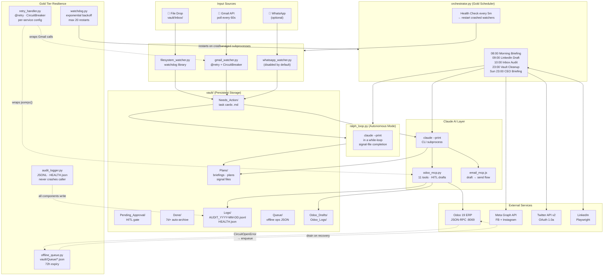

# Personal AI Employee — Gold Tier

> An autonomous, self-healing AI system that monitors email, manages an Odoo 19 ERP,
> posts to social media, audits finances weekly, and briefs the CEO — all with
> structured audit logs, exponential-backoff retries, and graceful offline queuing.

**Stack:** Claude Code · Claude CLI · Python 3.10+ · Odoo 19 · FastMCP · Gmail API · Meta Graph API · Twitter API v2

---

## Architecture



---

## Tier Breakdown

| Tier | Files | What it does |
|------|-------|-------------|
| **Bronze** | `filesystem_watcher.py` | Watches `vault/Inbox/` → task cards |
| **Silver** | `gmail_watcher.py`, `whatsapp_watcher.py`, `linkedin_poster.py`, Claude plan generation | Monitor 3 channels, classify, plan, HITL email send |
| **Gold** | `orchestrator.py`, `ralph_loop.py`, `watchdog.py`, `audit_logger.py`, `retry_handler.py`, `offline_queue.py`, `odoo_mcp.py`, `ceo_briefing.py`, social MCPs | Full scheduling, ERP, CEO briefing, self-healing, structured logs |

---

## Project Layout

```
AI Empolyee/
├── orchestrator.py          # Main scheduler (Gold entry point)
├── ralph_loop.py            # Autonomous multi-step Claude loop
├── watchdog.py              # Process supervisor — restarts orchestrator on crash
│
├── audit_logger.py          # Structured JSONL logging (imported by all components)
├── retry_handler.py         # @retry decorator + CircuitBreaker (3-state machine)
├── offline_queue.py         # File-based durable queue (vault/Queue/)
│
├── watchers/
│   ├── filesystem_watcher.py    # Bronze: vault/Inbox → Needs_Action
│   ├── gmail_watcher.py         # Silver: Gmail → Needs_Action + retry + CB
│   ├── whatsapp_watcher.py      # Silver: WhatsApp (optional, requires QR scan)
│   ├── linkedin_poster.py       # Gold: LinkedIn draft→post via Playwright
│   ├── meta_poster.py           # Gold: Facebook + Instagram post
│   ├── meta_summary.py          # Gold: FB/IG engagement analytics
│   ├── twitter_poster.py        # Gold: Twitter/X auto-post
│   ├── twitter_summary.py       # Gold: Twitter analytics
│   └── ceo_briefing.py          # Gold: Weekly CEO audit engine
│
├── mcp/
│   ├── odoo_mcp.py              # Gold: 11 Odoo tools, HITL drafts, retry+CB
│   ├── meta_mcp.py              # Gold: Meta Graph API tools
│   └── twitter_mcp.py           # Gold: Twitter API tools
│
├── vault/
│   ├── Inbox/                   # File drop zone
│   ├── Needs_Action/            # Unprocessed task cards (YAML+Markdown)
│   ├── Pending_Approval/        # HITL gate — human reviews before execution
│   ├── Done/                    # Auto-archived after 7 days
│   ├── Plans/                   # AI-generated plans, briefings, signal files
│   ├── Queue/                   # Offline queue JSON files (Odoo etc.)
│   ├── Logs/                    # AUDIT_YYYY-MM-DD.jsonl + HEALTH.json
│   ├── Odoo_Drafts/             # HITL draft cards for Odoo write ops
│   ├── Odoo_Logs/               # Odoo action audit trail (JSON)
│   ├── Business_Goals.md        # Revenue targets, KPIs, audit rules
│   ├── SKILLS.md                # AI capabilities manifest
│   └── Dashboard.md             # Live status (refreshed every 30m)
│
├── .claude/
│   ├── mcp.json                 # MCP server registrations
│   └── settings.json            # Claude Code hooks (Ralph Loop stop hook)
│
├── docs/
│   ├── TEST_GUIDE.md            # End-to-end test scenarios
│   ├── ERRORS_AND_FIXES.md      # Common errors and exact fixes
│   ├── LESSONS_LEARNED.md       # Build retrospective
│   └── SUBMISSION_CHECKLIST.md  # Hackathon submission checklist
│
└── logs/                        # Process stdout logs (orchestrator, watchers)
```

---

## Quickstart

### Prerequisites

```bash
pip install schedule watchdog requests \
    google-api-python-client google-auth-oauthlib \
    mcp python-dotenv playwright
playwright install chromium
```

### Environment

Edit `.claude/mcp.json` with your credentials:

```json
{
  "mcpServers": {
    "ai-employee-odoo": {
      "command": "python",
      "args": ["D:\\path\\mcp\\odoo_mcp.py"],
      "env": {
        "ODOO_URL":      "http://localhost:8069",
        "ODOO_DB":       "ai-employee",
        "ODOO_USER":     "admin@example.com",
        "ODOO_PASSWORD": "your_password"
      }
    }
  }
}
```

For Gmail: place `watchers/credentials.json` (OAuth Desktop app from Google Cloud Console).

### Run

```bash
# Recommended: watchdog supervises everything
python watchdog.py

# Or run the orchestrator directly
python orchestrator.py

# Manual CEO briefing (skip Odoo for quick test)
python watchers/ceo_briefing.py --no-odoo

# One-shot health check
python watchdog.py --once

# Check offline queue depth
python -c "from offline_queue import get_queue; print(get_queue('odoo'))"
```

---

## Key Patterns

### HITL Drafts (Odoo)
All write operations produce a draft first — Claude proposes, human approves, system executes:
```
claude: odoo_draft_invoice(partner="Acme", lines=[...])
        → vault/Odoo_Drafts/ODOO_invoice_abc123.md  [preview saved]
human:  "Yes, create it" (draft_id: abc123)
claude: odoo_confirm_invoice("abc123")
        → Odoo invoice created (DRAFT state, human validates in UI)
        → vault/Odoo_Logs/ODOO_LOG_*.json  [audit entry]
        → vault/Logs/AUDIT_*.jsonl         [structured log]
```

### Circuit Breaker + Offline Queue
When Odoo is unreachable, confirmed operations are queued — not lost:
```
CircuitBreaker(failures≥5) → OPEN → CircuitOpenError raised
odoo_mcp catches it → get_queue("odoo").enqueue("create_invoice", payload)
                    → vault/Queue/odoo_<id>.json saved to disk

Odoo recovers → CircuitBreaker: HALF_OPEN → probe succeeds → CLOSED
Drain:  odoo_q.drain(executor_fn)  ← replays all queued ops in order
```

### Autonomous Ralph Loop
Claude processes entire directories without human prompting between steps:
```
orchestrator (10:00 PKT) → ralph_loop.py --done-type signal_file
  → while not done:
      claude --print "process Needs_Action cards (batch 3)"
      [Claude: reads cards, classifies, creates Plans/, sets status]
      RALPH_PROGRESS: 7/12 cards processed
  → Claude writes: vault/Plans/NEEDS_ACTION_COMPLETE_2026-02-19.md
  → ralph_loop detects signal → exits, writes RALPH_LOG_*.md
```

### Structured Audit Log
Every component emits JSON events to `vault/Logs/AUDIT_YYYY-MM-DD.jsonl`:
```json
{"ts":"2026-02-19T10:00:01+05:00","severity":"INFO","component":"gmail_watcher","event":"task_created","task":"EMAIL_Invoice_Query.md","priority":"high"}
{"ts":"2026-02-19T10:00:07+05:00","severity":"WARN","component":"retry_handler","event":"api_retry","service":"odoo","attempt":2,"retry_in_seconds":4.2}
{"ts":"2026-02-19T10:00:09+05:00","severity":"WARN","component":"retry_handler","event":"circuit_open","service":"odoo","failure_count":5,"recovery_in_seconds":120}
```

---

## Scheduled Tasks

| Time (PKT) | Task | Output |
|------------|------|--------|
| 08:00 daily | Morning briefing via Claude | `vault/Plans/DAILY_BRIEFING_*.md` |
| 09:00 daily | LinkedIn draft generation | `vault/LinkedIn_Drafts/DRAFT_scheduled_*.md` |
| 10:00 daily | Needs_Action audit — Ralph Loop | Plans for all cards + signal file |
| Every 30m | Dashboard refresh | `vault/Dashboard.md` |
| Every 5m | Watcher health check | Auto-restarts crashed watchers |
| 23:00 daily | Vault cleanup | Move 7d+ completed cards to `Done/` |
| Sunday 23:00 | CEO Briefing — full audit | `vault/Plans/CEO_BRIEFING_*.md` |

---

## Resilience Settings

**Retry backoffs** (`retry_handler.py` — `RETRY_CONFIGS`):

| Service | Attempts | Base Delay | Max Delay |
|---------|----------|------------|-----------|
| Claude | 3 | 5s | 30s |
| Odoo | 5 | 2s | 120s |
| Gmail | 4 | 3s | 60s |
| Meta / Twitter / LinkedIn | 3 | 30s | 300s |

**Circuit breaker** (`CIRCUIT_CONFIGS`):

| Service | Failure Threshold | Recovery Timeout |
|---------|-----------------|-----------------|
| Odoo | 5 failures | 120s |
| Gmail | 5 failures | 60s |
| Meta / Twitter | 3 failures | 300s |

**Watchdog** (`watchdog.py` — `SUPERVISED`):

| Process | Max Restarts | Base Backoff | Cap |
|---------|-------------|-------------|-----|
| orchestrator | 20 | 5s | 300s |

---

## Tier Roadmap

| Tier | Feature | Status |
|------|---------|--------|
| Bronze | Filesystem watcher + task card generation | Done |
| Silver | Gmail + WhatsApp watchers + Claude plan trigger | Done |
| Silver | Priority detection, deduplication, HITL email | Done |
| Silver | LinkedIn poster (Claude drafts + Playwright) | Done |
| Silver | Orchestrator + PM2 persistence | Done |
| Gold | Odoo 19 MCP — HITL invoices + payments (11 tools) | Done |
| Gold | Meta Graph API MCP (FB + Instagram) | Done |
| Gold | Twitter API v2 MCP + analytics | Done |
| Gold | Ralph Loop — autonomous multi-step processing | Done |
| Gold | Weekly CEO Briefing — KPI audit + Claude narrative | Done |
| Gold | audit_logger.py — structured JSONL logging | Done |
| Gold | retry_handler.py — @retry + CircuitBreaker | Done |
| Gold | offline_queue.py — durable offline queue | Done |
| Gold | watchdog.py — process supervisor | Done |

---

## Troubleshooting Quick-Reference

| Symptom | Fix |
|---------|-----|
| `ModuleNotFoundError: audit_logger` | Add project root to `sys.path` or run from project root |
| Odoo: `CircuitOpenError` | Check `vault/Logs/HEALTH.json` for circuit state; check Odoo is running |
| Gmail: token expired | Delete `watchers/gmail_token.json` → restart → re-auth in browser |
| Watchdog: max restarts exceeded | Check `logs/orchestrator.log`; fix root cause; restart watchdog |
| Offline queue growing | Odoo circuit stuck OPEN; check `vault/Queue/` count |
| `claude: command not found` | Install Claude Code: `npm install -g @anthropic-ai/claude-code` |
| Watcher keeps crashing | Check `logs/<name>.log` for traceback |

Full 30-error reference: **[docs/ERRORS_AND_FIXES.md](docs/ERRORS_AND_FIXES.md)**

---

## See Also

- [`docs/TEST_GUIDE.md`](docs/TEST_GUIDE.md) — End-to-end test scenarios
- [`docs/ERRORS_AND_FIXES.md`](docs/ERRORS_AND_FIXES.md) — Common errors + exact fixes
- [`docs/LESSONS_LEARNED.md`](docs/LESSONS_LEARNED.md) — Build retrospective
- [`docs/SUBMISSION_CHECKLIST.md`](docs/SUBMISSION_CHECKLIST.md) — Hackathon submission checklist
- [`vault/SKILLS.md`](vault/SKILLS.md) — Full AI capabilities manifest
- [`vault/Business_Goals.md`](vault/Business_Goals.md) — Revenue targets and KPI rules

---

## License

MIT
